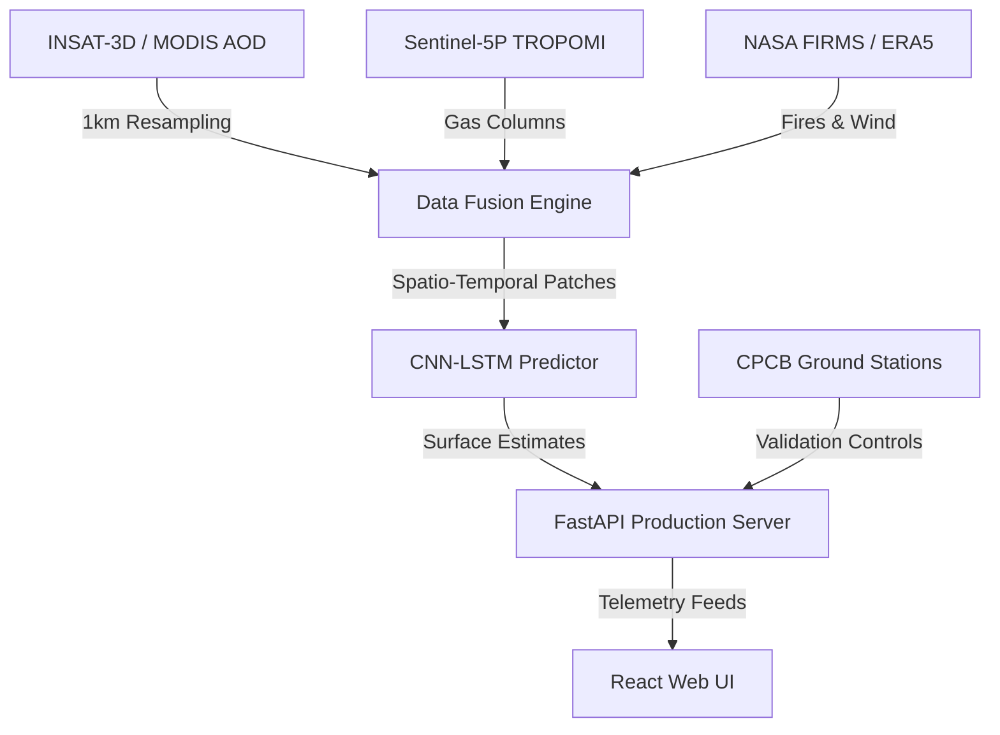

# 📍 Vayusense: Surface AQI & HCHO Hotspot Intelligence Portal

Vayusense is a production-grade production React + FastAPI environmental intelligence platform built for the **Development of Surface AQI & Identification of HCHO Hotspots over India using Satellite Data**. Developed under the scientific context of the Space Applications Centre (**ISRO SAC**), Ahmedabad, it fuses multi-sensor spaceborne observations with ground monitoring networks to diagnose, predict, and analyze air quality parameters.

---

## 🚀 Key Features

*   **Spatio-Temporal CNN-LSTM Model**: Predicts ground-level Surface AQI by analyzing 11x11 spatial patches around monitoring stations with a 7-day temporal lag ($T=7$) to prevent spatial/temporal data leakage.
*   **AI Location Intelligence Hub**: Allows users to search for any location in India or click coordinates directly on an interactive Leaflet map to generate instantaneous satellite reports, weather parameters, and clinical health guidelines.
*   **Multi-Satellite Data Fusion**:
    *   **INSAT-3D / MODIS**: Aerosol Optical Depth (AOD)
    *   **Sentinel-5P TROPOMI**: Tropospheric gaseous column densities (HCHO, $\text{NO}_2$, $\text{SO}_2$, $\text{CO}$, $\text{O}_3$)
    *   **NASA FIRMS**: Thermal anomalies and biomass burning active counts
    *   **ECMWF ERA5**: Boundary layer wind velocity components ($U$, $V$) to model transport trajectories
*   **Atmospheric Plume Advection**: Computes regional pollutant transport vectors and matches active agricultural stubble fire hotspots with downstream wind dispersion corridors.
*   **High-Fidelity Dashboard UI**: Premium space-themed dark layout featuring custom micro-animations, glassmorphic widgets, and interactive Leaflet map panels.

---

## 📐 Production Architecture



---

## 📂 Project Structure

```
├── aqi_prediction/         # Deep Learning Core
│   ├── cnn_lstm.py         # CNN-LSTM network architecture and training scripts
│   ├── model_checkpoint.h5 # Trained weights archive
│   └── data_pipeline.py    # Resampling, quality filtering, and spatial matching
├── frontend/               # React Web Application (Vite SPA)
│   ├── src/
│   │   ├── components/     # Reusable UI widgets & Layout panels
│   │   ├── context/        # State managers (FilterContext.jsx)
│   │   ├── pages/          # Dashboard views (Home, AQI Map, HCHO, Transport)
│   │   └── App.jsx         # Main router entrypoint
│   └── vite.config.js
├── server.py               # FastAPI backend router & simulation telemetry
├── requirements.txt        # Python package manifests
├── render.yaml             # Render deployment blueprint config
└── README.md               # System documentation
```

---

## 🛠️ Installation & Setup

### Prerequisites
*   Python 3.8 or higher
*   Node.js (v18 or higher)
*   npm or yarn

### 1. Backend FastAPI Gateway
1.  Clone the repository and navigate to the project root directory.
2.  Install the required Python packages:
    ```bash
    pip install -r requirements.txt
    ```
3.  Start the FastAPI production server:
    ```bash
    python server.py
    ```
    *The API will be available at `http://localhost:8000`.*

### 2. Frontend React Application
1.  Navigate to the frontend directory:
    ```bash
    cd frontend
    ```
2.  Install dependencies:
    ```bash
    npm install
    ```
3.  Start the Vite local development server:
    ```bash
    npm run dev
    ```
    *The web application will launch at `http://localhost:5174` (or `http://localhost:5173`).*

---

## ☁️ Production Deployment

### Frontend Deployment (Vercel)
The React frontend is configured for deployment on Vercel:
1. Connect your GitHub repository to Vercel.
2. Set the build folder directory to `frontend`.
3. Build command: `npm run build`.
4. Output directory: `dist`.
5. Environment Variables:
   * `VITE_API_URL`: Your deployed FastAPI backend URL (e.g., `https://vayusense-backend.onrender.com/api`).

### Backend Deployment (Render)
The FastAPI backend uses `render.yaml` for automatic deployment:
1. Log in to Render and create a new **Blueprint** service.
2. Select your repository.
3. Render will auto-discover the `render.yaml` file, provisioning the web service and building using `requirements.txt`.

---

## 🛡️ License & Credits

*   **Lead Agency**: Space Applications Centre (**ISRO SAC**), Ahmedabad, India.
*   **Data Providers**: Central Pollution Control Board (CPCB) India, ESA Copernicus Sentinel Open Access Hub, NASA LANCE Near Real-Time Active Fire Services.
